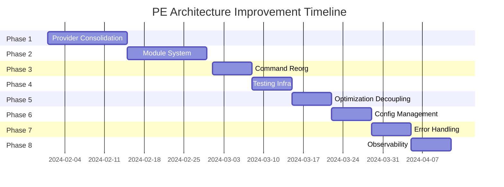

# PE Architecture Improvement Plan

## Overview
This document outlines a phased approach to improving the PE toolkit architecture based on comprehensive analysis of the current codebase. The plan prioritizes critical architectural issues while preserving the toolkit's existing strengths.

## Current State Assessment

### Strengths to Preserve
- Sophisticated metaprompting algorithms (TextGrad, GASO, PE2)
- Comprehensive evaluation system with 20+ assertion types
- Strong security foundations with input validation
- Unix philosophy with composable commands
- Clean provider abstraction design

### Critical Issues to Address
1. Dual provider interfaces causing confusion
2. Incomplete module system with placeholders
3. Insufficient test coverage (~40% overall)
4. Command organization scaling issues
5. Tight coupling between optimization and providers

## Implementation Phases

### Phase 1: Provider Interface Consolidation (Week 1-2)
**Goal**: Eliminate dual provider interface pattern, standardize on single interface

#### Tasks:
1. **Audit Provider Usage** (2 days)
   ```go
   // Map all usages of llm.Provider vs inference.Provider
   // Document which commands use which interface
   // Identify migration complexity for each usage
   ```

2. **Maintain Migration Interface**
   `internal/inference/migration.go` now provides `LegacyAdapter`, which adapts
   `llm.Provider` implementations to `inference.Provider`. Remaining work is to
   reduce call sites that still require the adapter.

3. **Migrate Commands** (3 days)
   - Update `cmd/pe/run.go` to use `inference.Provider`
   - Update `cmd/pe/optimize.go` and related optimization commands
   - Update `cmd/pe/eval.go` for evaluation commands
   - Update test commands

4. **Remove Legacy Interface** (1 day)
   - Delete `internal/llm/provider.go`
   - Remove legacy provider implementations
   - Update all imports

5. **Testing & Validation** (2 days)
   - Run full test suite
   - Manual testing of critical paths
   - Performance regression testing

#### Success Criteria:
- Single provider interface throughout codebase
- All existing functionality preserved
- No performance degradation

### Phase 2: Module System Implementation (Week 3-4)
**Goal**: Complete the module system with proper registry and dependency management

#### Tasks:
1. **Design Registry Architecture** (2 days)
   ```yaml
   # Registry options:
   option_1:
     type: git_based
     repo: github.com/pe-modules/registry
     format: releases
   
   option_2:
     type: http_api
     endpoint: https://registry.pe.dev
     auth: token_based
   
   option_3:
     type: decentralized
     protocol: ipfs
     index: github
   ```

2. **Implement Module Resolution** (3 days)
   ```go
   // internal/module/resolver.go
   type Resolver struct {
       registry Registry
       cache    Cache
       lock     *LockFile
   }
   
   func (r *Resolver) Resolve(module string) (*Module, error) {
       // 1. Check cache
       // 2. Query registry
       // 3. Validate signatures
       // 4. Download and cache
   }
   ```

3. **Add Dependency Management** (2 days)
   ```go
   // internal/module/deps.go
   type DependencyGraph struct {
       modules map[string]*Module
       edges   map[string][]string
   }
   
   func (d *DependencyGraph) ResolveDependencies() error {
       // Topological sort
       // Conflict detection
       // Version resolution
   }
   ```

4. **Implement Module Commands** (2 days)
   - Complete `pe mod init` with proper initialization
   - Fix `pe mod download` with actual registry
   - Implement `pe mod vendor` properly
   - Add `pe mod verify` for integrity checking

5. **Create Initial Registry** (1 day)
   - Set up GitHub repo or simple HTTP server
   - Publish core modules
   - Document module format

#### Success Criteria:
- Working module resolution and download
- Dependency management with conflict resolution
- At least 5 core modules in registry
- Module verification and signing

### Phase 3: Command Architecture Reorganization (Week 5)
**Goal**: Reorganize generated CLI commands into logical groups for better maintainability

#### Tasks:
1. **Design Command Taxonomy** (1 day)
   ```
   pe/
   ├── core/           (run, build, test)
   ├── evaluation/     (eval, benchmark, diff)
   ├── optimization/   (optimize, semantic, evolve)
   ├── module/         (mod init, mod download)
   ├── pipeline/       (stream, filter, extract)
   ├── utility/        (fmt, vet, convert)
   └── experimental/   (attest, security)
   ```

2. **Implement Command Groups** (2 days)
   ```go
   // cmd/pe/commands/registry.go
   type CommandRegistry struct {
       groups map[string]*CommandGroup
   }
   
   type CommandGroup struct {
       Name        string
       Description string
       Commands    []*cobra.Command
       Hidden      bool
   }
   
   func (r *CommandRegistry) RegisterGroup(group *CommandGroup) {
       r.groups[group.Name] = group
   }
   ```

3. **Refactor Command Files** (2 days)
   - Move commands to appropriate packages
   - Update imports and registrations
   - Preserve backward compatibility

4. **Add Subcommand Support** (1 day)
   ```bash
   pe eval run config.yaml
   pe optimize textgrad prompt.txt
   pe module list
   ```

#### Success Criteria:
- Commands organized into 6-8 logical groups
- Improved help and documentation
- Backward compatibility maintained
- Easier to find related commands

### Phase 4: Testing Infrastructure (Week 6)
**Goal**: Improve test coverage from 40% to 70%+

#### Tasks:
1. **Create Testing Framework** (2 days)
   ```go
   // internal/testing/framework.go
   type TestFramework struct {
       providers map[string]*MockProvider
       fixtures  *FixtureManager
       asserts   *AssertionEngine
   }
   ```

2. **Implement Comprehensive Mocks** (2 days)
   ```go
   // internal/testing/mocks/provider.go
   type MockProvider struct {
       responses map[string]Response
       behavior  BehaviorConfig
       metrics   *CallMetrics
   }
   
   type BehaviorConfig struct {
       Latency      time.Duration
       ErrorRate    float64
       Deterministic bool
   }
   ```

3. **Add Property-Based Tests** (2 days)
   ```go
   // internal/metaprompt/optimization_test.go
   func TestOptimizationProperties(t *testing.T) {
       quick.Check(func(prompt string, iterations uint8) bool {
           result := optimizer.Optimize(prompt, int(iterations))
           return result.Score >= 0 && result.Score <= 1
       }, nil)
   }
   ```

4. **Integration Test Suite** (2 days)
   ```go
   // tests/integration/e2e_test.go
   func TestEndToEndWorkflows(t *testing.T) {
       scenarios := []Scenario{
           BasicEvaluation{},
           OptimizationPipeline{},
           ModuleWorkflow{},
       }
       for _, s := range scenarios {
           t.Run(s.Name(), s.Execute)
       }
   }
   ```

#### Success Criteria:
- 70%+ test coverage
- Property-based tests for optimization algorithms
- Comprehensive integration tests
- Fast, reliable test execution

### Phase 5: Optimization Decoupling (Week 7)
**Goal**: Decouple optimization algorithms from specific provider implementations

#### Tasks:
1. **Define Optimization Interfaces** (1 day)
   ```go
   // internal/optimization/interfaces.go
   type Optimizer interface {
       Optimize(ctx context.Context, config Config) (*Result, error)
   }
   
   type Evaluator interface {
       Evaluate(ctx context.Context, prompt string) (float64, error)
   }
   
   type GradientProvider interface {
       ComputeGradient(ctx context.Context, prompt string) (*Gradient, error)
   }
   ```

2. **Implement Strategy Pattern** (2 days)
   ```go
   // internal/optimization/strategy.go
   type OptimizationStrategy struct {
       evaluator Evaluator
       optimizer Optimizer
       config    Config
   }
   
   func (s *OptimizationStrategy) Execute(ctx context.Context) (*Result, error) {
       // Strategy-specific optimization logic
   }
   ```

3. **Create Provider Adapters** (2 days)
   ```go
   // internal/optimization/adapters/
   type ProviderAdapter struct {
       provider inference.Provider
   }
   
   func (p *ProviderAdapter) Evaluate(ctx context.Context, prompt string) (float64, error) {
       // Adapt provider to evaluator interface
   }
   ```

#### Success Criteria:
- Optimization algorithms work with any provider
- Clean separation of concerns
- Easier to add new optimization methods
- No performance degradation

### Phase 6: Configuration Management (Week 8)
**Goal**: Implement centralized configuration system

#### Tasks:
1. **Design Configuration Schema** (1 day)
   ```yaml
   # ~/.pe/config.yaml
   version: 1
   defaults:
     provider: openai
     model: gpt-4
     temperature: 0.7
   
   providers:
     openai:
       api_key: ${OPENAI_API_KEY}
       organization: ${OPENAI_ORG}
     
   optimization:
     max_iterations: 10
     convergence_threshold: 0.95
   ```

2. **Implement Config Manager** (2 days)
   ```go
   // internal/config/manager.go
   type ConfigManager struct {
       sources []Source
       cache   map[string]interface{}
       mu      sync.RWMutex
   }
   
   func (c *ConfigManager) Get(key string) interface{} {
       // Hierarchical lookup: CLI > ENV > File > Default
   }
   ```

3. **Add Validation** (1 day)
   ```go
   // internal/config/validator.go
   type Validator struct {
       schema *Schema
   }
   
   func (v *Validator) Validate(config Config) []error {
       // Schema validation
       // Type checking
       // Required fields
   }
   ```

#### Success Criteria:
- Centralized configuration management
- Environment variable support
- Configuration validation
- Hot reload capability

### Phase 7: Error Handling Enhancement (Week 9)
**Goal**: Standardize error handling across codebase

#### Tasks:
1. **Define Error Types** (1 day)
   ```go
   // internal/errors/types.go
   type PEError struct {
       Code    ErrorCode
       Message string
       Details map[string]interface{}
       Cause   error
   }
   
   type ErrorCode string
   const (
       ErrProviderFailure ErrorCode = "PROVIDER_FAILURE"
       ErrOptimization    ErrorCode = "OPTIMIZATION_ERROR"
       ErrModuleNotFound  ErrorCode = "MODULE_NOT_FOUND"
   )
   ```

2. **Implement Error Wrapping** (2 days)
   ```go
   // internal/errors/wrap.go
   func WrapProviderError(err error, provider string) error {
       return &PEError{
           Code:    ErrProviderFailure,
           Message: fmt.Sprintf("provider %s failed", provider),
           Details: map[string]interface{}{"provider": provider},
           Cause:   err,
       }
   }
   ```

3. **Add Error Recovery** (2 days)
   ```go
   // internal/errors/recovery.go
   type RecoveryStrategy interface {
       Recover(error) error
   }
   
   type RetryStrategy struct {
       maxAttempts int
       backoff     time.Duration
   }
   ```

#### Success Criteria:
- Consistent error types throughout
- Proper error context preservation
- Actionable error messages
- Recovery strategies for transient failures

### Phase 8: Observability (Week 10)
**Goal**: Add comprehensive metrics and tracing

#### Tasks:
1. **Implement Metrics Collection** (2 days)
   ```go
   // internal/metrics/collector.go
   type MetricsCollector struct {
       counters   map[string]*Counter
       histograms map[string]*Histogram
       gauges     map[string]*Gauge
   }
   
   func (m *MetricsCollector) RecordLatency(operation string, duration time.Duration) {
       m.histograms[operation].Observe(duration.Seconds())
   }
   ```

2. **Add Distributed Tracing** (2 days)
   ```go
   // internal/tracing/tracer.go
   import "go.opentelemetry.io/otel"
   
   func InitTracing() {
       tp := trace.NewTracerProvider(
           trace.WithBatcher(exporter),
           trace.WithResource(resource),
       )
       otel.SetTracerProvider(tp)
   }
   ```

3. **Create Dashboards** (1 day)
   - Prometheus metrics export
   - Grafana dashboard templates
   - Alert configurations

#### Success Criteria:
- Key metrics tracked (latency, throughput, errors)
- Distributed tracing for optimization workflows
- Exportable metrics for monitoring
- Performance insights dashboard

## Implementation Timeline



## Risk Mitigation

### Technical Risks
1. **Breaking Changes**
   - Mitigation: Comprehensive test suite before changes
   - Fallback: Feature flags for gradual rollout

2. **Performance Regression**
   - Mitigation: Benchmark before/after each phase
   - Fallback: Optimization phase if needed

3. **Module System Complexity**
   - Mitigation: Start with simple registry, iterate
   - Fallback: File-based modules as MVP

### Process Risks
1. **Scope Creep**
   - Mitigation: Strict phase boundaries
   - Review after each phase

2. **Timeline Slippage**
   - Mitigation: Buffer time between phases
   - Core phases (1-4) are priority

## Success Metrics

### Quantitative
- Test coverage: 40% → 70%+
- Command organization: 48 flat → 6-8 groups
- Provider interfaces: 2 → 1
- Module system: 0% → 100% complete
- Error types: 0 → 10+ defined

### Qualitative
- Easier onboarding for new contributors
- Clearer architectural boundaries
- Better debugging and troubleshooting
- Improved maintainability

## Next Steps

1. **Immediate** (This Week)
   - Review and approve this plan
   - Set up tracking for implementation
   - Begin Phase 1 audit

2. **Short Term** (Next Month)
   - Complete Phases 1-3 (critical issues)
   - Establish module registry infrastructure
   - Recruit additional contributors if needed

3. **Long Term** (Quarter)
   - Complete all 8 phases
   - Documentation updates
   - v1.0 release preparation

## Conclusion

This phased approach addresses PE's architectural issues while preserving its strengths. The plan prioritizes critical issues (provider interfaces, module system) while building toward a more maintainable and extensible architecture. Each phase delivers tangible improvements and can be validated independently, reducing risk and ensuring steady progress toward a production-ready toolkit.
